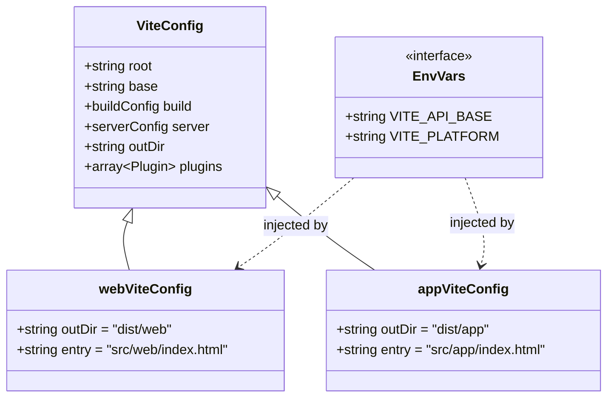
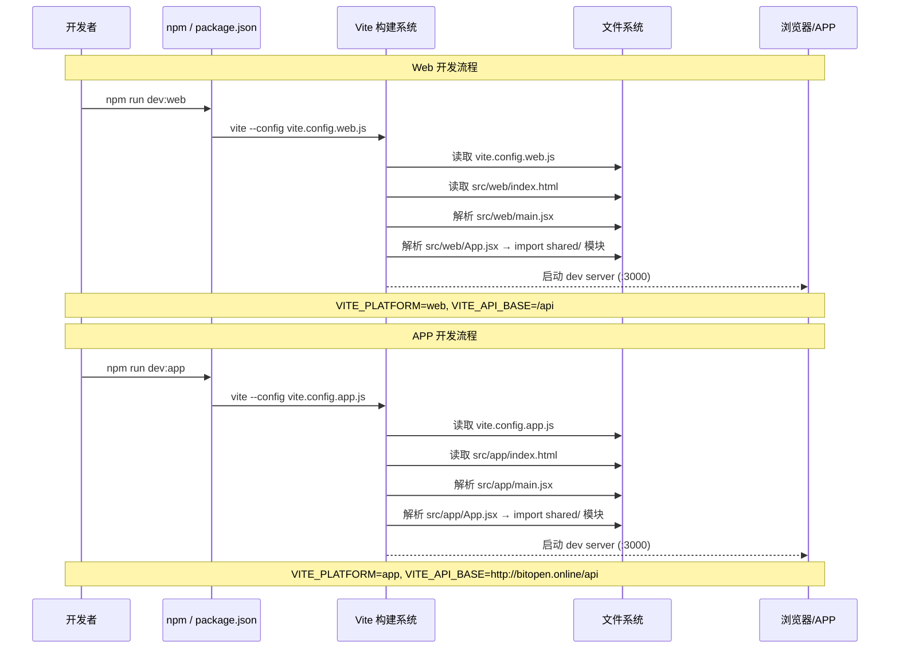
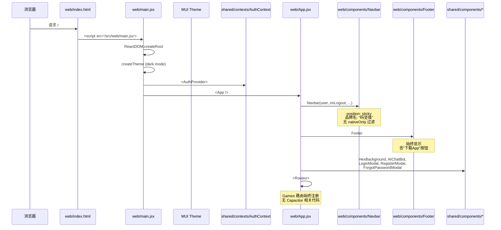
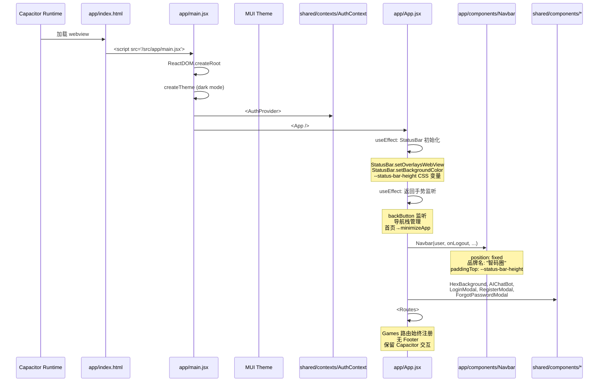
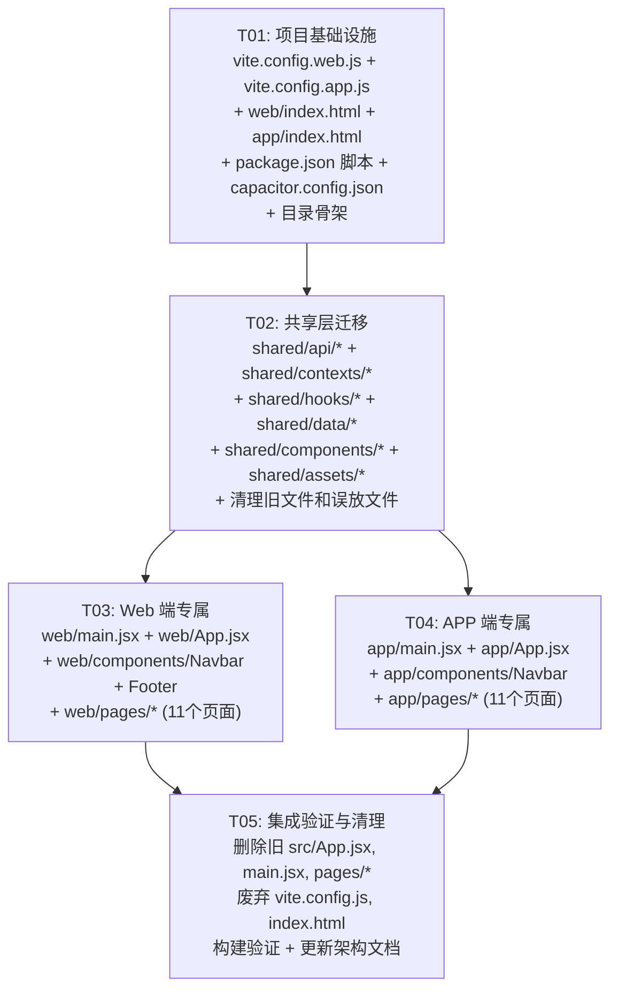

# 码坚强 Monorepo 多入口重构 — 架构设计与任务分解

> **作者**: Bob (Architect)  
> **日期**: 2026-06-04  
> **版本**: v1.0  
> **状态**: 待评审

---

## Part A: 系统设计

---

### 1. 实现方案

#### 1.1 核心技术挑战

| 挑战 | 分析 | 方案 |
|------|------|------|
| `isNativeApp` 遍布 7 个文件、22 处引用 | 运行时分端导致代码耦合，难以维护 | Monorepo 物理分端：shared/ + web/ + app/ 三区分离，编译期决定归属 |
| Capacitor 依赖在全量构建中被打包 | Web 构建产出包含 Capacitor 代码，体积增大 | 双 vite.config，app 构建引入 Capacitor，web 构建完全排除 |
| 共用的 UI 组件（LoginModal 等）含少量平台差异（PRIVACY_URL） | 全量拆分成本高，不拆分则残留 isNativeApp | 引入 `import.meta.env.VITE_PLATFORM` 环境变量替代运行时分端 |
| 共用 API 层 `client.js` 含 API_BASE 平台逻辑 | 原生 APP 需要直连服务器 IP，Web 端走 Vite proxy | 提取为 `import.meta.env.VITE_API_BASE`，由构建配置注入 |

#### 1.2 框架与库选型

**核心原则：保持现有技术栈不变，仅在架构层面调整目录结构和构建配置。**

| 技术 | 版本 | 用途 | 变更 |
|------|------|------|------|
| Vite | ^5.2 | 构建工具 | 单配置 → 双配置（vite.config.web.js + vite.config.app.js） |
| React | ^18.3 | UI 框架 | 不变 |
| React Router | ^6.23 | 路由 | 路由定义拆分到 web/App.jsx + app/App.jsx |
| MUI | ^5.15 | 组件库 | 不变 |
| Tailwind CSS | ^3.4 | 样式工具 | 不变 |
| Capacitor | ^8.x | 原生容器 | 仅 app 构建引入，web 构建不打包 |

#### 1.3 架构模式

```
src/
├── shared/          ← 两端完全共用（编译期无关）
│   ├── api/         ← Axios 实例 + API 函数
│   ├── contexts/    ← React Context
│   ├── hooks/       ← 自定义 Hooks
│   ├── data/        ← 静态数据
│   ├── components/  ← 共用 UI 组件（无平台分支）
│   └── assets/      ← 静态图片资源
│
├── web/             ← 网站专属（编译期决定，不含 Capacitor）
│   ├── index.html
│   ├── main.jsx
│   ├── App.jsx
│   ├── pages/
│   └── components/
│
├── app/             ← APP 专属（编译期决定，含 Capacitor）
│   ├── index.html
│   ├── main.jsx
│   ├── App.jsx
│   ├── pages/
│   └── components/
│
├── index.css        ← 全局样式（两端共用）
├── vite.config.web.js
└── vite.config.app.js
```

---

### 2. 文件列表

#### 2.1 需要创建的文件（新）

| # | 文件路径 | 说明 |
|---|---------|------|
| F-01 | `src/shared/api/client.js` | 从 `src/api/client.js` 迁移，移除 `isNativeApp`，改用 `import.meta.env.VITE_API_BASE` |
| F-02 | `src/shared/api/auth.js` | 从 `src/api/auth.js` 迁移，更新 import path → `./client` |
| F-03 | `src/shared/api/tools.js` | 从 `src/api/tools.js` 迁移，更新 import path → `./client` |
| F-04 | `src/shared/api/socket.js` | 从 `src/api/socket.js` 迁移 |
| F-05 | `src/shared/contexts/AuthContext.jsx` | 从 `src/contexts/AuthContext.jsx` 迁移，更新 import path → `../api/auth` |
| F-06 | `src/shared/hooks/useCardGlow.js` | 从 `src/hooks/useCardGlow.js` 迁移 |
| F-07 | `src/shared/data/agents.js` | 从 `src/data/agents.js` 迁移 |
| F-08 | `src/shared/data/tools.js` | 从 `src/data/tools.js` 迁移 |
| F-09 | `src/shared/data/banners.js` | 从 `src/data/banners.js` 迁移 |
| F-10 | `src/shared/assets/lobster-sheet.png` | 从 `src/assets/lobster-sheet.png` 迁移 |
| F-11 | `src/shared/assets/pixel-room.png` | 从 `src/assets/pixel-room.png` 迁移 |
| F-12 | `src/shared/components/HeroBanner.jsx` | 从 `src/components/HeroBanner.jsx` 迁移，更新 import path |
| F-13 | `src/shared/components/HexBackground.jsx` | 从 `src/components/HexBackground.jsx` 迁移 |
| F-14 | `src/shared/components/AIChatBot.jsx` | 从 `src/components/AIChatBot.jsx` 迁移 |
| F-15 | `src/shared/components/PixelPet.jsx` | 从 `src/components/PixelPet.jsx` 迁移 |
| F-16 | `src/shared/components/LoginModal.jsx` | 从 `src/components/LoginModal.jsx` 迁移，移除 `isNativeApp`，PRIVACY_URL 改用环境变量 |
| F-17 | `src/shared/components/RegisterModal.jsx` | 从 `src/components/RegisterModal.jsx` 迁移，同上处理 PRIVACY_URL |
| F-18 | `src/shared/components/ForgotPasswordModal.jsx` | 从 `src/components/ForgotPasswordModal.jsx` 迁移 |
| F-19 | `src/shared/components/SocialLogin.jsx` | 从 `src/components/SocialLogin.jsx` 迁移，移除 `isNativeApp`，用环境变量 `VITE_PLATFORM` 替代 |
| F-20 | `src/web/index.html` | 从根 `index.html` 复制，精简 viewport，指向 `src/web/main.jsx` |
| F-21 | `src/web/main.jsx` | 从 `src/main.jsx` 复制，无 Capacitor 相关逻辑 |
| F-22 | `src/web/App.jsx` | 从 `src/App.jsx` 拆分 — 移除 StatusBar/back gesture/Capacitor 导入，`Games` 路由始终显示，Footer 始终显示 |
| F-23 | `src/web/components/Navbar.jsx` | 从 `src/components/Navbar.jsx` 拆分 — 移除 `nativeOnly` 过滤，品牌名始终"码坚强"，position=sticky |
| F-24 | `src/web/components/Footer.jsx` | 从 `src/components/Footer.jsx` 拆分 — 始终显示，始终显示"下载App"按钮 |
| F-25 | `src/web/pages/Home.jsx` | 从 `src/pages/Home.jsx` 复制（当前无 isNativeApp 逻辑，后续可差异开发） |
| F-26 | `src/web/pages/Agents.jsx` | 从 `src/pages/Agents.jsx` 复制（两端一致） |
| F-27 | `src/web/pages/Skills.jsx` | 从 `src/pages/Skills.jsx` 复制 |
| F-28 | `src/web/pages/ToolsDownload.jsx` | 从 `src/pages/ToolsDownload.jsx` 复制 |
| F-29 | `src/web/pages/Games.jsx` | 从 `src/pages/Games.jsx` 复制 |
| F-30 | `src/web/pages/Social.jsx` | 从 `src/pages/Social.jsx` 复制 |
| F-31 | `src/web/pages/Chat.jsx` | 从 `src/pages/Chat.jsx` 复制 |
| F-32 | `src/web/pages/ChannelChat.jsx` | 从 `src/pages/ChannelChat.jsx` 复制 |
| F-33 | `src/web/pages/AccountSettings.jsx` | 从 `src/pages/AccountSettings.jsx` 复制 |
| F-34 | `src/web/pages/Feedback.jsx` | 从 `src/pages/Feedback.jsx` 复制 |
| F-35 | `src/web/pages/OAuthCallback.jsx` | 从 `src/pages/OAuthCallback.jsx` 复制 |
| F-36 | `src/app/index.html` | 从根 `index.html` 定制 — Capacitor 兼容 viewport，指向 `src/app/main.jsx` |
| F-37 | `src/app/main.jsx` | 从 `src/main.jsx` 定制 — 保留 Capacitor 相关内容 |
| F-38 | `src/app/App.jsx` | 从 `src/App.jsx` 拆分 — 保留 StatusBar 初始化、back gesture、导航栈，Games 路由始终显示，移除 Footer |
| F-39 | `src/app/components/Navbar.jsx` | 从 `src/components/Navbar.jsx` 拆分 — 品牌名始终"智码圈"，position=fixed，保留 status-bar-height |
| F-40 | `src/app/pages/Home.jsx` | 从 `src/pages/Home.jsx` 复制（当前内容一致） |
| F-41~50 | `src/app/pages/*.jsx` | 同 web/pages/，从原 pages/ 复制（当前一致，后续可差异开发） |

#### 2.2 需要修改的文件

| # | 文件路径 | 修改内容 |
|---|---------|---------|
| M-01 | `package.json` | 新增 `dev:web`、`dev:app`、`build:web`、`build:app`、`preview:web`、`preview:app` 脚本 |
| M-02 | `vite.config.web.js` | **新建** — build.outDir = `dist/web`，root = `.`，指向 `src/web/index.html` |
| M-03 | `vite.config.app.js` | **新建** — build.outDir = `dist/app`，root = `.`，指向 `src/app/index.html` |
| M-04 | `capacitor.config.json` | `webDir` 从 `"dist"` 改为 `"dist/app"` |
| M-05 | `src/index.css` | 保持不变（全局样式两端共用） |

#### 2.3 需要删除/废弃的文件

| # | 文件路径 | 原因 |
|---|---------|------|
| D-01 | `src/App.jsx` | 拆分为 web/App.jsx + app/App.jsx |
| D-02 | `src/main.jsx` | 拆分为 web/main.jsx + app/main.jsx |
| D-03 | `src/api/client.js` | 迁移至 shared/api/client.js |
| D-04 | `src/api/auth.js` | 迁移至 shared/api/auth.js |
| D-05 | `src/api/tools.js` | 迁移至 shared/api/tools.js |
| D-06 | `src/api/socket.js` | 迁移至 shared/api/socket.js |
| D-07 | `src/api/AuthContext.jsx` | **清理** — 疑似误放文件，内容与 contexts/AuthContext.jsx 重复 |
| D-08 | `src/api/RegisterModal.jsx` | **清理** — 疑似误放文件，内容与 components/RegisterModal.jsx 重复 |
| D-09 | `src/contexts/AuthContext.jsx` | 迁移至 shared/contexts/AuthContext.jsx |
| D-10 | `src/contexts/auth.js` | **清理** — 疑似旧版/误放文件 |
| D-11 | `src/contexts/LoginModal.jsx` | **清理** — 疑似误放文件 |
| D-12 | `src/contexts/RegisterModal.jsx` | **清理** — 疑似误放文件 |
| D-13 | `src/hooks/useCardGlow.js` | 迁移至 shared/hooks/useCardGlow.js |
| D-14 | `src/data/agents.js` | 迁移至 shared/data/agents.js |
| D-15 | `src/data/tools.js` | 迁移至 shared/data/tools.js |
| D-16 | `src/data/banners.js` | 迁移至 shared/data/banners.js |
| D-17 | `src/components/Navbar.jsx` | 拆分为 web/components/Navbar.jsx + app/components/Navbar.jsx |
| D-18 | `src/components/Footer.jsx` | 迁移至 web/components/Footer.jsx（Web 独有） |
| D-19 | `src/components/HeroBanner.jsx` | 迁移至 shared/components/HeroBanner.jsx |
| D-20 | `src/components/HexBackground.jsx` | 迁移至 shared/components/HexBackground.jsx |
| D-21 | `src/components/LoginModal.jsx` | 迁移至 shared/components/LoginModal.jsx |
| D-22 | `src/components/RegisterModal.jsx` | 迁移至 shared/components/RegisterModal.jsx |
| D-23 | `src/components/ForgotPasswordModal.jsx` | 迁移至 shared/components/ForgotPasswordModal.jsx |
| D-24 | `src/components/AIChatBot.jsx` | 迁移至 shared/components/AIChatBot.jsx |
| D-25 | `src/components/SocialLogin.jsx` | 迁移至 shared/components/SocialLogin.jsx |
| D-26 | `src/components/PixelPet.jsx` | 迁移至 shared/components/PixelPet.jsx |
| D-27 | `src/pages/*.jsx`（11 个页面） | 迁移至 web/pages/ + app/pages/（各复制一份） |
| D-28 | `src/assets/lobster-sheet.png` | 迁移至 shared/assets/lobster-sheet.png |
| D-29 | `src/assets/pixel-room.png` | 迁移至 shared/assets/pixel-room.png |
| D-30 | `vite.config.js` | 废弃，由 vite.config.web.js 和 vite.config.app.js 替代 |
| D-31 | `index.html`（根目录） | 废弃，由 web/index.html + app/index.html 替代 |

> **注意**: D-07 至 D-12 是清理当前 `src/api/` 和 `src/contexts/` 目录下的重复/误放文件，与主要重构无关但应一并清理。

#### 2.4 最终目录结构

```
src/
├── index.css                              ← 全局样式
├── shared/
│   ├── api/
│   │   ├── client.js                      ← Axios 实例 + 拦截器
│   │   ├── auth.js                        ← 认证 API
│   │   ├── tools.js                       ← 工具 API
│   │   └── socket.js                      ← Socket.IO 客户端
│   ├── contexts/
│   │   └── AuthContext.jsx                ← 认证上下文 + useAuth hook
│   ├── hooks/
│   │   └── useCardGlow.js                ← 卡片光泽效果
│   ├── data/
│   │   ├── agents.js                      ← Agent 推荐数据
│   │   ├── tools.js                       ← 工具数据
│   │   └── banners.js                     ← 轮播图数据
│   ├── components/
│   │   ├── HeroBanner.jsx                 ← 首页轮播
│   │   ├── HexBackground.jsx             ← 全站背景动画
│   │   ├── LoginModal.jsx                ← 登录弹窗
│   │   ├── RegisterModal.jsx             ← 注册弹窗
│   │   ├── ForgotPasswordModal.jsx       ← 找回密码弹窗
│   │   ├── AIChatBot.jsx                 ← AI 小助手浮窗
│   │   ├── SocialLogin.jsx               ← 微信/QQ 登录
│   │   └── PixelPet.jsx                  ← 像素宠物
│   └── assets/
│       ├── lobster-sheet.png
│       └── pixel-room.png
├── web/
│   ├── index.html                         ← Web 入口 HTML
│   ├── main.jsx                           ← Web 入口 JS
│   ├── App.jsx                            ← Web 路由
│   ├── components/
│   │   ├── Navbar.jsx                     ← Web 导航栏（sticky, "码坚强"）
│   │   └── Footer.jsx                     ← Web 底部（始终显示）
│   └── pages/
│       ├── Home.jsx
│       ├── Agents.jsx
│       ├── Skills.jsx
│       ├── ToolsDownload.jsx
│       ├── Games.jsx
│       ├── Social.jsx
│       ├── Chat.jsx
│       ├── ChannelChat.jsx
│       ├── AccountSettings.jsx
│       ├── Feedback.jsx
│       └── OAuthCallback.jsx
├── app/
│   ├── index.html                         ← APP 入口 HTML（Capacitor 兼容）
│   ├── main.jsx                           ← APP 入口 JS
│   ├── App.jsx                            ← APP 路由（+StatusBar/back gesture）
│   ├── components/
│   │   └── Navbar.jsx                     ← APP 导航栏（fixed, "智码圈"）
│   └── pages/
│       ├── Home.jsx
│       ├── Agents.jsx
│       ├── Skills.jsx
│       ├── ToolsDownload.jsx
│       ├── Games.jsx
│       ├── Social.jsx
│       ├── Chat.jsx
│       ├── ChannelChat.jsx
│       ├── AccountSettings.jsx
│       ├── Feedback.jsx
│       └── OAuthCallback.jsx
├── vite.config.web.js                     ← Web 构建配置
└── vite.config.app.js                     ← APP 构建配置
```

---

### 3. 数据结构和接口

本次重构是纯架构层面的调整，**不新增**数据模型或 API 接口。需要关注的是环境变量接口和构建配置接口的变化。

#### 3.1 环境变量接口



| 环境变量 | Web 构建值 | APP 构建值 | 用途 |
|---------|-----------|-----------|------|
| `VITE_API_BASE` | `/api`（Vite proxy） | `http://bitopen.online/api` | Axios baseURL |
| `VITE_PLATFORM` | `web` | `app` | 替代运行时 `isNativeApp` |

#### 3.2 client.js 关键变化

```javascript
// 重构前（src/api/client.js）：
const isNativeApp = typeof window !== 'undefined' && (
  window.Capacitor !== undefined || window.location.protocol === 'capacitor:'
);
const API_BASE = isNativeApp ? 'http://bitopen.online/api' : '/api';

// 重构后（src/shared/api/client.js）：
const API_BASE = import.meta.env.VITE_API_BASE || '/api';
```

#### 3.3 SocialLogin.jsx 关键变化

```javascript
// 重构前：
const isNativeApp = ...;
if (isNativeApp) {
  const { Browser } = await import('@capacitor/browser');
  // ... 使用 Capacitor Browser
} else {
  window.location.href = authUrl;
}

// 重构后：
const platform = import.meta.env.VITE_PLATFORM || 'web';
if (platform === 'app') {
  const { Browser } = await import('@capacitor/browser');
  // ... 使用 Capacitor Browser
} else {
  window.location.href = authUrl;
}
```

> ⚠️ **注意**: `@capacitor/browser` 的 dynamic import 在 Web 构建中不会被触发（VITE_PLATFORM=web），因此 Web 构建不会包含 Capacitor 代码。但 `@capacitor/browser` 仍需留在 `dependencies` 中以支持 APP 构建。

---

### 4. 程序调用流程

#### 4.1 开发/构建命令流程



#### 4.2 Web 端渲染流程



#### 4.3 APP 端渲染流程



---

### 5. 待明确事项

| # | 事项 | 建议方案 | 状态 |
|---|------|---------|------|
| Q-01 | `shared/` 中是否存放 UI 组件？还是全部归入各端？ | **建议**: 完全共用的 UI 组件（LoginModal、RegisterModal、HeroBanner 等）放 `shared/components/`，含少量平台差异的（SocialLogin）也用环境变量处理而非分端 | ⏳ 待确认 |
| Q-02 | 页面组件（Agents、Skills 等）当前两端完全一致，是否先放 shared/？ | **建议**: 先在 `web/pages/` 和 `app/pages/` 各复制一份，后续差异大了各自改。如果全放 shared/，未来拆分时可能漏改 import | ✅ 已决定 |
| Q-03 | `import.meta.env.VITE_API_BASE` 在 dev:app 模式下应该用什么值？ | **建议**: dev:app 通过 Vite proxy 指向服务器，API_BASE=/api；生产 APP 构建时才使用直连地址。vite.config.app.js 中通过 `define` 或 `.env` 文件控制 | ⏳ 待确认 |
| Q-04 | Capacitor 的 `webDir` 改为 `dist/app` 后，部署流程是否需要调整？ | **建议**: `capacitor.config.json` 中 `webDir` 改为 `"dist/app"`，CAP 构建命令变为 `npm run build:app && npx cap sync`。需要验证 Android/iOS 项目配置 | ⏳ 待确认 |
| Q-05 | 原有的 `npm run dev`（无后缀）默认指向哪个端？ | **建议**: 保持指向 Web（等效 `npm run dev:web`），以兼容旧的开发习惯和 CI 配置 | ✅ 已决定 |
| Q-06 | `index.css` 全局样式是否两端完全共用？ | **建议**: 保持 `src/index.css` 不变，两端均 import 此文件 | ✅ 已决定 |
| Q-07 | `src/api/` 和 `src/contexts/` 目录下存在重复/误放文件（AuthContext.jsx, LoginModal.jsx 等），是否一并清理？ | **建议**: 在 T02 共享层迁移时一并清理删除 | ⏳ 待确认 |

---

## Part B: 任务分解

---

### 6. 必需依赖包

**无需新增任何依赖包。** 当前 `package.json` 中已有的依赖已经覆盖全部需求。

当前关键依赖（不需要变）：

```
- react@^18.3.1              ← UI 框架
- react-dom@^18.3.1          ← DOM 渲染
- react-router-dom@^6.23.1   ← 路由
- @mui/material@^5.15.20     ← 组件库
- @mui/icons-material@^5.15 ← 图标
- @emotion/react@^11.11      ← CSS-in-JS
- axios@^1.7.2               ← HTTP 客户端
- socket.io-client@^4.8.3    ← WebSocket
- @capacitor/core@^8.3       ← Capacitor 核心
- @capacitor/app@^8.1        ← APP 生命周期
- @capacitor/status-bar@^8.0 ← 状态栏
- @capacitor/browser@^8.0    ← 系统浏览器（SocialLogin）
- vite@^5.2                  ← 构建工具
- @vitejs/plugin-react@^4.3  ← Vite React 插件
- tailwindcss@^3.4           ← 样式工具
- autoprefixer@^10.4         ← CSS 前缀
- postcss@^8.4               ← CSS 处理
```

---

### 7. 任务列表

| Task ID | 任务名称 | 源文件 | 依赖 | 优先级 |
|---------|---------|--------|------|--------|
| **T01** | 项目基础设施：创建构建配置、入口文件、目录骨架 | 见下方详述 | 无 | P0 |
| **T02** | 共享层迁移：创建 shared/ 目录并迁移共用代码 + 清理旧文件 | 见下方详述 | T01 | P0 |
| **T03** | Web 端专属：创建 web/main.jsx, App.jsx, Navbar, Footer + pages | 见下方详述 | T02 | P0 |
| **T04** | APP 端专属：创建 app/main.jsx, App.jsx, Navbar + pages | 见下方详述 | T02 | P0 |
| **T05** | 集成验证：废弃旧文件、更新 Capacitor 配置、更新文档、构建验证 | 见下方详述 | T03, T04 | P0 |

---

#### T01: 项目基础设施

**目标**: 搭建 Monorepo 骨架 — 创建目录结构、构建配置、入口 HTML 文件、更新 package.json 脚本。

| 操作 | 文件 | 说明 |
|------|------|------|
| **创建** | `vite.config.web.js` | Vite 配置，root=`.`，outDir=`dist/web`，dev port=3000，proxy `/api`→localhost:3001。通过 `define` 注入 `VITE_PLATFORM=web` |
| **创建** | `vite.config.app.js` | Vite 配置，root=`.`，outDir=`dist/app`，dev port=3000，proxy 配置同 web。通过 `define` 注入 `VITE_PLATFORM=app` |
| **修改** | `package.json` | 新增脚本：`dev`/`dev:web`/`dev:app`/`build:web`/`build:app`/`preview:web`/`preview:app`，各自指向对应 config |
| **创建** | `src/web/index.html` | 从根 `index.html` 复制，修改 `<script>` 指向 `/src/web/main.jsx`，标准 viewport |
| **创建** | `src/app/index.html` | 从根 `index.html` 定制，`viewport-fit=cover`，`user-scalable=no`，指向 `/src/app/main.jsx` |
| **修改** | `capacitor.config.json` | `webDir` 从 `"dist"` → `"dist/app"` |
| **创建** | 目录结构 | `mkdir -p src/shared/api src/shared/contexts src/shared/hooks src/shared/data src/shared/components src/shared/assets src/web/pages src/web/components src/app/pages src/app/components` |

**vite.config.web.js 关键内容**:
```js
import { defineConfig } from 'vite';
import react from '@vitejs/plugin-react';

export default defineConfig({
  plugins: [react()],
  base: './',
  define: {
    'import.meta.env.VITE_PLATFORM': JSON.stringify('web'),
    'import.meta.env.VITE_API_BASE': JSON.stringify('/api'),
  },
  server: {
    port: 3000,
    open: true,
    proxy: { '/api': { target: 'http://localhost:3001', changeOrigin: true } },
  },
  build: { outDir: 'dist/web', sourcemap: false },
});
```

**vite.config.app.js 关键内容**:
```js
import { defineConfig } from 'vite';
import react from '@vitejs/plugin-react';

export default defineConfig({
  plugins: [react()],
  base: './',
  define: {
    'import.meta.env.VITE_PLATFORM': JSON.stringify('app'),
    'import.meta.env.VITE_API_BASE': JSON.stringify('/api'),
  },
  server: {
    port: 3000,
    proxy: { '/api': { target: 'http://localhost:3001', changeOrigin: true } },
  },
  build: { outDir: 'dist/app', sourcemap: false },
});
```

> **注意**: dev:app 模式下 API_BASE 设为 `/api`（走 Vite proxy），生产构建时可在 CI 中通过环境变量覆盖为直连地址。

**package.json 新增脚本**:
```json
{
  "scripts": {
    "dev": "vite --config vite.config.web.js",
    "dev:web": "vite --config vite.config.web.js",
    "dev:app": "vite --config vite.config.app.js",
    "build:web": "vite build --config vite.config.web.js",
    "build:app": "vite build --config vite.config.app.js",
    "preview:web": "vite preview --config vite.config.web.js",
    "preview:app": "vite preview --config vite.config.app.js",
    "dev:server": "node server/index.js"
  }
}
```

---

#### T02: 共享层迁移

**目标**: 将两端完全共用的代码从 `src/` 搬入 `src/shared/`，更新内部 import 路径，同时清理旧目录下的重复/误放文件。

| 操作 | 目标路径 | 说明 |
|------|---------|------|
| **迁移** | `src/shared/api/client.js` | 从 `src/api/client.js` 迁移。**关键改动**: `API_BASE` 改为 `import.meta.env.VITE_API_BASE \|\| '/api'`，移除 `isNativeApp` 变量 |
| **迁移** | `src/shared/api/auth.js` | 从 `src/api/auth.js` 迁移。更新 import: `'./client'` |
| **迁移** | `src/shared/api/tools.js` | 从 `src/api/tools.js` 迁移。更新 import: `'./client'` |
| **迁移** | `src/shared/api/socket.js` | 从 `src/api/socket.js` 迁移。无 import 变更 |
| **迁移** | `src/shared/contexts/AuthContext.jsx` | 从 `src/contexts/AuthContext.jsx` 迁移。更新 import: `'../api/auth'` |
| **迁移** | `src/shared/hooks/useCardGlow.js` | 从 `src/hooks/useCardGlow.js` 迁移 |
| **迁移** | `src/shared/data/agents.js` | 从 `src/data/agents.js` 迁移 |
| **迁移** | `src/shared/data/tools.js` | 从 `src/data/tools.js` 迁移 |
| **迁移** | `src/shared/data/banners.js` | 从 `src/data/banners.js` 迁移 |
| **迁移** | `src/shared/components/HeroBanner.jsx` | 从 `src/components/HeroBanner.jsx` 迁移 |
| **迁移** | `src/shared/components/HexBackground.jsx` | 从 `src/components/HexBackground.jsx` 迁移 |
| **迁移** | `src/shared/components/AIChatBot.jsx` | 从 `src/components/AIChatBot.jsx` 迁移 |
| **迁移** | `src/shared/components/PixelPet.jsx` | 从 `src/components/PixelPet.jsx` 迁移 |
| **迁移** | `src/shared/components/ForgotPasswordModal.jsx` | 从 `src/components/ForgotPasswordModal.jsx` 迁移 |
| **迁移** | `src/shared/components/LoginModal.jsx` | 从 `src/components/LoginModal.jsx` 迁移。**关键改动**: PRIVACY_URL 改为 `import.meta.env.VITE_PLATFORM === 'app' ? 'http://bitopen.online/privacy.html' : '/privacy.html'`，移除 `isNativeApp` |
| **迁移** | `src/shared/components/RegisterModal.jsx` | 从 `src/components/RegisterModal.jsx` 迁移。同上处理 PRIVACY_URL |
| **迁移** | `src/shared/components/SocialLogin.jsx` | 从 `src/components/SocialLogin.jsx` 迁移。**关键改动**: `isNativeApp` 改为 `import.meta.env.VITE_PLATFORM === 'app'` |
| **迁移** | `src/shared/assets/lobster-sheet.png` | 从 `src/assets/lobster-sheet.png` 迁移 |
| **迁移** | `src/shared/assets/pixel-room.png` | 从 `src/assets/pixel-room.png` 迁移 |
| **删除** | `src/api/client.js` | 已迁移 |
| **删除** | `src/api/auth.js` | 已迁移 |
| **删除** | `src/api/tools.js` | 已迁移 |
| **删除** | `src/api/socket.js` | 已迁移 |
| **删除** | `src/api/AuthContext.jsx` | 重复/误放文件，清理 |
| **删除** | `src/api/RegisterModal.jsx` | 重复/误放文件，清理 |
| **删除** | `src/contexts/AuthContext.jsx` | 已迁移 |
| **删除** | `src/contexts/auth.js` | 旧版/误放文件，清理 |
| **删除** | `src/contexts/LoginModal.jsx` | 重复/误放文件，清理 |
| **删除** | `src/contexts/RegisterModal.jsx` | 重复/误放文件，清理 |
| **删除** | `src/hooks/useCardGlow.js` | 已迁移 |
| **删除** | `src/data/agents.js` | 已迁移 |
| **删除** | `src/data/tools.js` | 已迁移 |
| **删除** | `src/data/banners.js` | 已迁移 |
| **删除** | `src/components/HeroBanner.jsx` | 已迁移 |
| **删除** | `src/components/HexBackground.jsx` | 已迁移 |
| **删除** | `src/components/AIChatBot.jsx` | 已迁移 |
| **删除** | `src/components/PixelPet.jsx` | 已迁移 |
| **删除** | `src/components/LoginModal.jsx` | 已迁移 |
| **删除** | `src/components/RegisterModal.jsx` | 已迁移 |
| **删除** | `src/components/ForgotPasswordModal.jsx` | 已迁移 |
| **删除** | `src/components/SocialLogin.jsx` | 已迁移 |
| **删除** | `src/assets/lobster-sheet.png` | 已迁移 |
| **删除** | `src/assets/pixel-room.png` | 已迁移 |

> ⚠️ **import 路径更新清单**：迁移后的 shared/ 内部文件之间使用相对路径。例如 `src/shared/contexts/AuthContext.jsx` 中 `import * as authApi from '../api/auth'`。`src/shared/components/LoginModal.jsx` 中 `import { useAuth } from '../contexts/AuthContext'`。`src/shared/components/SocialLogin.jsx` 中 `import client from '../api/client'`。

---

#### T03: Web 端专属代码

**目标**: 创建 `src/web/` 下的入口文件、路由、专属组件和页面。

| 操作 | 文件 | 说明 |
|------|------|------|
| **创建** | `src/web/main.jsx` | 从 `src/main.jsx` 复制。无 Capacitor 相关逻辑。import path: `App` → `'./App'`，`AuthContext` → `'../shared/contexts/AuthContext'`，`index.css` → `'../index.css'` |
| **创建** | `src/web/App.jsx` | 从 `src/App.jsx` 拆分。**关键改动**: 移除 `isNativeApp` 声明，移除 StatusBar/back gesture/Capacitor 的动态 import 和 useEffect，`Games` 路由始终显示，`Footer` 始终渲染。import path: 所有组件 → `../shared/components/...`，pages → `./pages/...`，Navbar → `./components/Navbar`，Footer → `./components/Footer` |
| **创建** | `src/web/components/Navbar.jsx` | 从 `src/components/Navbar.jsx` 拆分。**关键改动**: 移除 `nativeOnly` 过滤逻辑（所有导航项始终显示），品牌名始终"码坚强"，`position: 'sticky'`，移除 `--status-bar-height` 处理 |
| **创建** | `src/web/components/Footer.jsx` | 从 `src/components/Footer.jsx` 拆分。**关键改动**: 移除 `isNativeApp` 检查，Footer 始终渲染，"下载App"按钮始终显示 |
| **创建** | `src/web/pages/Home.jsx` | 从 `src/pages/Home.jsx` 复制。import path: `HeroBanner` → `'../../shared/components/HeroBanner'`，`useCardGlow` → `'../../shared/hooks/useCardGlow'` |
| **创建** | `src/web/pages/Agents.jsx` | 从 `src/pages/Agents.jsx` 复制，更新 import paths |
| **创建** | `src/web/pages/Skills.jsx` | 从 `src/pages/Skills.jsx` 复制，更新 import paths |
| **创建** | `src/web/pages/ToolsDownload.jsx` | 从 `src/pages/ToolsDownload.jsx` 复制，更新 import paths |
| **创建** | `src/web/pages/Games.jsx` | 从 `src/pages/Games.jsx` 复制，更新 import paths |
| **创建** | `src/web/pages/Social.jsx` | 从 `src/pages/Social.jsx` 复制，更新 import paths |
| **创建** | `src/web/pages/Chat.jsx` | 从 `src/pages/Chat.jsx` 复制，更新 import paths |
| **创建** | `src/web/pages/ChannelChat.jsx` | 从 `src/pages/ChannelChat.jsx` 复制，更新 import paths |
| **创建** | `src/web/pages/AccountSettings.jsx` | 从 `src/pages/AccountSettings.jsx` 复制，更新 import paths |
| **创建** | `src/web/pages/Feedback.jsx` | 从 `src/pages/Feedback.jsx` 复制，更新 import paths |
| **创建** | `src/web/pages/OAuthCallback.jsx` | 从 `src/pages/OAuthCallback.jsx` 复制，更新 import paths |

> **import 路径规则**: `src/web/` 下的文件引用 shared 时使用 `../shared/...`。例如 `src/web/main.jsx` 中 `import { AuthProvider } from '../shared/contexts/AuthContext'`，`src/web/components/Navbar.jsx` 中 `import { useAuth } from '../../shared/contexts/AuthContext'`。

---

#### T04: APP 端专属代码

**目标**: 创建 `src/app/` 下的入口文件、路由、专属组件和页面。

| 操作 | 文件 | 说明 |
|------|------|------|
| **创建** | `src/app/main.jsx` | 从 `src/main.jsx` 复制。**关键改动**: 保留 Capacitor 生命周期初始化（可选）。import path: `App` → `'./App'`，`AuthContext` → `'../shared/contexts/AuthContext'`，`index.css` → `'../index.css'` |
| **创建** | `src/app/App.jsx` | 从 `src/App.jsx` 拆分。**关键改动**: 保留 `isNativeApp` 相关的 StatusBar 初始化（改用 `VITE_PLATFORM`）、back gesture 监听、导航栈管理、`--status-bar-height` CSS 变量。`Games` 路由始终显示（因为 APP 不需要过滤）。不渲染 Footer。import path 全部更新指向 shared/ |
| **创建** | `src/app/components/Navbar.jsx` | 从 `src/components/Navbar.jsx` 拆分。**关键改动**: `position: 'fixed'`，品牌名始终"智码圈"，保留 `--status-bar-height` 处理，无 `nativeOnly` 过滤 |
| **创建** | `src/app/pages/Home.jsx` | 从 `src/pages/Home.jsx` 复制，更新 import paths（同 web 版，APP 端后续可大幅改版） |
| **创建** | `src/app/pages/Agents.jsx` ~ `OAuthCallback.jsx` | 11 个页面全部复制，更新 import paths 指向 shared/ |

> **与 Web 的关键差异**: app/App.jsx 保留了 back gesture（导航栈），app/components/Navbar.jsx 固定定位并适配状态栏高度，无 Footer 组件。

---

#### T05: 集成验证与清理

**目标**: 废弃旧的单入口文件、根配置文件、验证构建、更新文档。

| 操作 | 文件 | 说明 |
|------|------|------|
| **删除** | `src/App.jsx` | 已拆分为 web/App.jsx + app/App.jsx |
| **删除** | `src/main.jsx` | 已拆分为 web/main.jsx + app/main.jsx |
| **删除** | `src/components/Navbar.jsx` | 已拆分为 web + app 版 |
| **删除** | `src/components/Footer.jsx` | 已移至 web/components/Footer.jsx |
| **删除** | `src/pages/Home.jsx` | 已复制到 web/pages/ + app/pages/ |
| **删除** | `src/pages/*.jsx`（其余 10 个页面的旧文件） | 已复制到两端 |
| **废弃** | `vite.config.js` | 由 vite.config.web.js + vite.config.app.js 替代 |
| **废弃** | `index.html`（根目录） | 由 web/index.html + app/index.html 替代。保留一份作为重定向，或直接删除 |
| **验证** | — | `npm run build:web` → 确认 dist/web/ 产出正确 |
| **验证** | — | `npm run build:app` → 确认 dist/app/ 产出正确 |
| **验证** | — | `npm run dev:web` → 网站正常访问，路由正常 |
| **验证** | — | `npm run dev:app` → APP 入口正常 |
| **验证** | — | 全局搜索 `isNativeApp` → 无结果（确认已完全移除） |
| **修改** | `docs/architecture.md` | 更新为新目录结构、构建方式、迁移指南（见下方概要） |

**docs/architecture.md 更新概要**:
- 更新目录结构图（shared/ + web/ + app/ 三区结构）
- 更新构建命令表（dev:web / dev:app / build:web / build:app）
- 添加"新增文件/迁移文件"索引表
- 添加 import 路径规则说明
- 添加 Capacitor 配置变更说明

---

### 8. 共享知识

```
## 目录结构规则
- src/shared/      ← 两端完全共用，不包含平台特定逻辑
- src/web/         ← 网站专属，不含 Capacitor 引用
- src/app/         ← APP 专属，可含 Capacitor 引用

## Import 路径规则
- shared/ 内部文件之间：相对路径，如 `'../api/client'`
- web/ → shared/：`'../shared/...'`，如 `'../shared/contexts/AuthContext'`
- app/ → shared/：`'../shared/...'`，如 `'../shared/contexts/AuthContext'`
- web/pages/ → shared/：`'../../shared/...'`
- web/components/ → shared/：`'../../shared/...'`
- 严禁 web/ 和 app/ 互相引用

## 环境变量约定
- import.meta.env.VITE_PLATFORM    web 构建值为 "web"，app 构建值为 "app"
- import.meta.env.VITE_API_BASE    web 构建值为 "/api"，app 构建值为 "/api"（dev）或直连地址（production）
- 替代旧的运行时 `isNativeApp` 检测

## 构建命令
- npm run dev[:web]     → Vite dev server（web 配置）
- npm run dev:app       → Vite dev server（app 配置）
- npm run build:web     → 构建输出到 dist/web/
- npm run build:app     → 构建输出到 dist/app/
- npm run dev:server    → 启动后端 Express（不变）

## Capacitor 配置
- capacitor.config.json 中 webDir: "dist/app"
- 构建流程：npm run build:app → npx cap copy → npx cap sync
- 仅 app 端构建包含 Capacitor 插件

## API 约定（不变）
- 基础 URL: import.meta.env.VITE_API_BASE（web=/api, app 视环境）
- 响应格式: { code, data, message }
- JWT: localStorage key='token', Authorization: Bearer <token>

## 保留的根配置文件
- postcss.config.js    ← 不变
- tailwind.config.js   ← 不变
- .gitignore           ← 不变

## 迁移要点
1. 保持 `src/index.css` 不变，两端共用
2. 保持 `public/` 目录不变，两端共用静态资源
3. server/ 目录完全不变
4. 先完成所有 shared/ 迁移和 web/ + app/ 创建，最后再删旧文件（便于回滚）
5. 每个 task 完成后运行对应构建命令验证
```

---

### 9. 任务依赖图



---

## 附录：isNativeApp 移除对照表

| 文件 | 原 isNativeApp 用途 | 重构后方案 |
|------|--------------------|-----------|
| `api/client.js` | API_BASE 选择（直连服务器 vs /api proxy） | `import.meta.env.VITE_API_BASE` |
| `App.jsx` | StatusBar/back gesture 初始化、Games 路由过滤、padding-top | web/App.jsx 移除；app/App.jsx 保留（用 VITE_PLATFORM 替代判断） |
| `Navbar.jsx` | nativeOnly 过滤、position 模式、品牌名切换 | webNavbar （"码坚强", sticky）；appNavbar（"智码圈", fixed） |
| `Footer.jsx` | Web 才显示 Footer 和下载按钮 | web/Footer.jsx（始终显示），app 无 Footer |
| `LoginModal.jsx` | PRIVACY_URL 选择 | `VITE_PLATFORM === 'app' ? ... : ...` |
| `RegisterModal.jsx` | PRIVACY_URL 选择 | 同上 |
| `SocialLogin.jsx` | Capacitor Browser vs window.location | `VITE_PLATFORM === 'app' ? ... : ...` |
