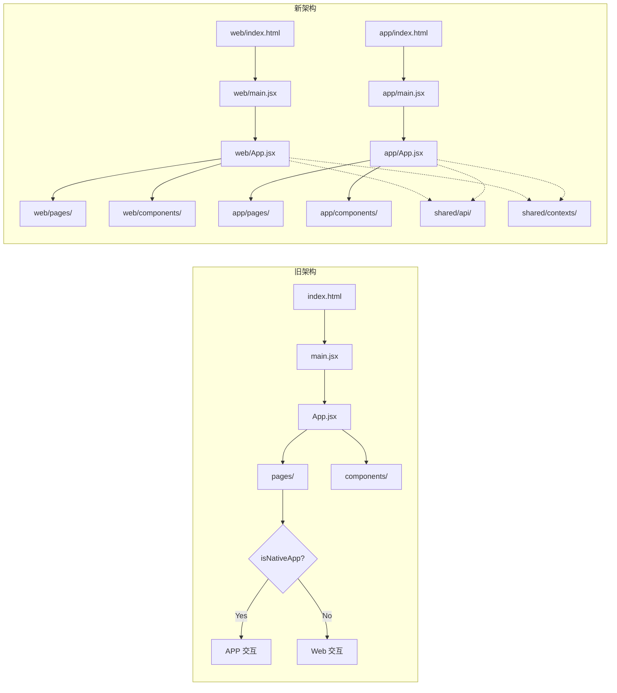

# 码坚强（CodeStrong）前端架构文档

> 最后更新：2026-06-04 | 版本：v1 → v2 架构升级

---

## 一、为什么需要架构升级

码坚强项目同时支持 **Web 网站**和 **Capacitor APP** 两个端。早期采用**同源单入口架构**，通过运行时检测 `isNativeApp` 变量来区分两端行为。

**问题**：
- 两端差异越大，`if (isNativeApp) ... else ...` 条件分支越爆炸
- 修改网页 UI 意外影响 APP（反之亦然）
- 代码可读性断崖下跌
- 后续 APP 计划大改版，差异只会持续扩大

**目标**：Monorepo + 双入口，共享核心层，独立表现层。

---

## 二、架构方案：Monorepo 双入口

```
code-strong/
├── src/
│   ├── shared/                  ← ★ 两端完全共用的代码
│   │   ├── api/                 ← API 请求（client.js, auth.js, tools.js, socket.js）
│   │   ├── contexts/            ← React Context（AuthContext）
│   │   ├── hooks/               ← 自定义 Hooks（useCardGlow）
│   │   ├── data/                ← 静态数据（agents.js, tools.js, banners.js）
│   │   ├── utils/               ← 工具函数
│   │   └── assets/              ← 共用静态资源
│   │
│   ├── web/                     ← ★ 网站专属
│   │   ├── main.jsx             ← 网站入口
│   │   ├── App.jsx              ← 网站路由
│   │   ├── index.html           ← 网站 HTML
│   │   ├── pages/               ← 网站页面
│   │   └── components/          ← 网站专属组件
│   │
│   ├── app/                     ← ★ APP 专属
│   │   ├── main.jsx             ← APP 入口
│   │   ├── App.jsx              ← APP 路由
│   │   ├── index.html           ← APP HTML
│   │   ├── pages/               ← APP 页面
│   │   └── components/          ← APP 专属组件
│   │
│   └── index.css                ← 全局样式（共用）
│
├── vite.config.web.js           ← 网站构建配置
├── vite.config.app.js           ← APP 构建配置
├── package.json                 ← 统一管理依赖
└── server/                      ← 后端（不变）
```

### 核心原则

| 层面 | 策略 |
|------|------|
| **路由** | 各端独立 `App.jsx`，互不干扰 |
| **页面** | `web/pages/` 和 `app/pages/` 各自实现 |
| **组件** | 差异大的（Navbar、Home、Social等）各端各自实现；完全相同的放 `shared/components/` |
| **API 层** | 全部放在 `shared/api/`，两端共用 |
| **Context** | 全部放在 `shared/contexts/`，两端共用 |
| **构建** | 两个 `vite.config`，`package.json` 加 `dev:web` / `dev:app` / `build:web` / `build:app` 脚本 |
| **Capacitor** | 只在 APP 构建配置和入口中引入 Capacitor 插件 |

---

## 三、共享层（shared/）内容细则

### 3.1 完全共用（直接搬入 shared/）

| 当前路径 | 目标路径 | 说明 |
|---------|---------|------|
| `src/api/client.js` | `src/shared/api/client.js` | Axios 实例 + 请求拦截 |
| `src/api/auth.js` | `src/shared/api/auth.js` 或合并入 client.js | 认证相关 API |
| `src/api/tools.js` | `src/shared/api/tools.js` | 工具 API |
| `src/api/socket.js` | `src/shared/api/socket.js` | Socket.IO 客户端 |
| `src/contexts/AuthContext.jsx` | `src/shared/contexts/AuthContext.jsx` | 认证上下文 |
| `src/hooks/useCardGlow.js` | `src/shared/hooks/useCardGlow.js` | 卡片光泽效果 |
| `src/data/agents.js` | `src/shared/data/agents.js` | Agent 数据 |
| `src/data/tools.js` | `src/shared/data/tools.js` | 工具数据 |
| `src/data/banners.js` | `src/shared/data/banners.js` | 轮播数据 |
| `src/index.css` | `src/index.css`（不变） | 全局样式两端共用 |
| `src/assets/` | `src/shared/assets/` | 静态图片资源 |

### 3.2 需要分端的组件

| 组件 | 策略 |
|------|------|
| `App.jsx` | 拆为 `web/App.jsx` + `app/App.jsx` |
| `main.jsx` | 拆为 `web/main.jsx` + `app/main.jsx` |
| `Navbar.jsx` | Web 和 APP 导航差异大 → 各自实现 |
| `Footer.jsx` | Web 有底部，APP 无 → Web 独有 |
| `Home.jsx` | 两端首页差异大 → 各自实现 |
| `Social.jsx` / `Chat.jsx` / `ChannelChat.jsx` | APP 社交交互差异大 → 各自实现 |

### 3.3 暂不拆分（先放共享层，后续需要再分）

| 组件 | 说明 |
|------|------|
| `HeroBanner.jsx` | 目前两端一致 |
| `HexBackground.jsx` | 纯视觉效果 |
| `LoginModal.jsx` / `RegisterModal.jsx` | 登录注册逻辑一致 |
| `ForgotPasswordModal.jsx` | 逻辑一致 |
| `AIChatBot.jsx` | AI 聊天机器人组件 |
| `SocialLogin.jsx` | 社交登录 |
| `PixelPet.jsx` | 像素宠物组件 |
| 大多数 pages（Agents, Skills, ToolsDownload 等） | 内容型页面两端基本一致 |
| `Games.jsx` | 小游戏两端一致 |

---

## 四、构建配置

### vite.config.web.js

```js
import { defineConfig } from 'vite';
import react from '@vitejs/plugin-react';

export default defineConfig({
  plugins: [react()],
  base: './',
  root: '.',
  server: {
    port: 3000,
    open: true,
    proxy: { '/api': { target: 'http://localhost:3001', changeOrigin: true } },
  },
  build: {
    outDir: 'dist/web',
    sourcemap: false,
  },
});
```

### vite.config.app.js

```js
import { defineConfig } from 'vite';
import react from '@vitejs/plugin-react';

export default defineConfig({
  plugins: [react()],
  base: './',
  root: '.',
  server: {
    port: 3000,
    proxy: { '/api': { target: 'http://localhost:3001', changeOrigin: true } },
  },
  build: {
    outDir: 'dist/app',
    sourcemap: false,
  },
});
```

### package.json 新增脚本

```json
{
  "scripts": {
    "dev": "vite --config vite.config.web.js",
    "dev:web": "vite --config vite.config.web.js",
    "dev:app": "vite --config vite.config.app.js",
    "build:web": "vite build --config vite.config.web.js",
    "build:app": "vite build --config vite.config.app.js",
    "preview:web": "vite preview --config vite.config.web.js",
    "preview:app": "vite preview --config vite.config.app.js"
  }
}
```

---

## 五、入口文件变化

### web/index.html（新）

```html
<!doctype html>
<html lang="zh-CN">
  <head>
    <meta charset="UTF-8" />
    <meta name="viewport" content="width=device-width, initial-scale=1.0" />
    <meta name="description" content="码坚强 - AI Agent 开发者社区" />
    <title>码坚强 - AI Agent 开发者社区</title>
  </head>
  <body>
    <div id="root"></div>
    <script type="module" src="/src/web/main.jsx"></script>
  </body>
</html>
```

### app/index.html（新）

```html
<!doctype html>
<html lang="zh-CN">
  <head>
    <meta charset="UTF-8" />
    <meta name="viewport" content="width=device-width, initial-scale=1.0, viewport-fit=cover, maximum-scale=1.0, user-scalable=no" />
    <meta name="description" content="码坚强 - AI Agent 开发者社区" />
    <title>码坚强</title>
  </head>
  <body>
    <div id="root"></div>
    <script type="module" src="/src/app/main.jsx"></script>
  </body>
</html>
```

---

## 六、迁移路线图

```
Phase 1: 搭建骨架（30分钟）
├── 创建 shared/ web/ app/ 目录
├── 创建两个 vite.config
├── 更新 package.json 脚本
└── 复制原有 main.jsx → web/main.jsx + app/main.jsx（暂不修改）

Phase 2: 搬共用代码（30分钟）
├── api/ → shared/api/
├── contexts/ → shared/contexts/
├── hooks/ → shared/hooks/
├── data/ → shared/data/
├── assets/ → shared/assets/
└── 更新所有 shared/ 内文件的相对导入路径

Phase 3: 拆分入口（30分钟）
├── 现有的 index.html → web/index.html + app/index.html
├── 现有的 App.jsx → web/App.jsx + app/App.jsx
├── 现有的 main.jsx → web/main.jsx + app/main.jsx
├── 移除 isNativeApp 运行时分端分支
├── 配置 vite.config 指向正确的入口
└── 更新 import 路径

Phase 4: 验证（15分钟）
├── npm run dev:web → 确认网站正常
├── npm run dev:app → 确认 APP 入口正常
├── npm run build:web → 确认构建通过
└── npm run build:app → 确认构建通过
```

---

## 七、注意事项

1. **vite.config 的 root 和 build.rollupOptions.input**：两个入口需要正确指向各自的 index.html 或 main.jsx
2. **Capacitor 配置**：`capacitor.config.ts` 中 `webDir` 指向 `dist/app`
3. **共享层引用**：shared/ 目录下的文件导入时不加 `shared/` 前缀，保持相对路径 `../shared/...`
4. **渐进式拆分**：如果某个页面两端暂时一致，可以先放 shared/pages/，后续差异大了再拉出来分端
5. **后端完全不变**：server/ 目录无需任何改动
6. **Git 提交建议**：建议分 4 次 commit（对应上述 4 个 Phase），便于 review

---

## 九、Monorepo 多入口重构（已完成）

> 重构日期：2026-06-04

### 9.1 新目录结构

```
code-strong/
├── src/
│   ├── shared/                  ← 两端完全共用的代码
│   │   ├── api/                 ← API 请求（client.js, auth.js, tools.js, socket.js）
│   │   ├── contexts/            ← React Context（AuthContext）
│   │   ├── hooks/               ← 自定义 Hooks（useCardGlow）
│   │   ├── data/                ← 静态数据（agents.js, tools.js, banners.js）
│   │   ├── components/          ← 共用组件（HeroBanner, HexBackground, LoginModal等）
│   │   └── assets/              ← 共用静态资源（lobster-sheet.png, pixel-room.png）
│   │
│   ├── web/                     ← 网站专属
│   │   ├── main.jsx             ← 网站入口（无 Capacitor）
│   │   ├── App.jsx              ← 网站路由（不带 StatusBar/back gesture）
│   │   ├── index.html           ← 网站 HTML
│   │   ├── pages/               ← 11 个页面
│   │   └── components/          ← Navbar（sticky, 码坚强品牌）+ Footer（始终渲染）
│   │
│   ├── app/                     ← APP 专属
│   │   ├── main.jsx             ← APP 入口（保留 Capacitor）
│   │   ├── App.jsx              ← APP 路由（带 StatusBar/back gesture）
│   │   ├── index.html           ← APP HTML
│   │   ├── pages/               ← 11 个页面
│   │   └── components/          ← Navbar（fixed, 智码圈品牌，带 status-bar-height）
│   │
│   └── index.css                ← 全局样式（共用）
│
├── vite.config.web.js           ← 网站构建配置（rollupOptions.input → src/web/index.html）
├── vite.config.app.js           ← APP 构建配置（rollupOptions.input → src/app/index.html）
├── package.json                 ← dev/build/preview 脚本区分 web/app
├── capacitor.config.json        ← webDir → "dist/app"
└── index.html.bak               ← 旧入口备份
```

### 9.2 构建命令表

| 命令 | 用途 |
|------|------|
| `npm run dev` / `npm run dev:web` | 启动 Web 开发服务器（端口 3000） |
| `npm run dev:app` | 启动 APP 开发服务器（端口 3000） |
| `npm run build` / `npm run build:web` | 构建 Web 版本（输出到 dist/web/） |
| `npm run build:app` | 构建 APP 版本（输出到 dist/app/） |
| `npm run preview:web` | 预览 Web 构建产物 |
| `npm run preview:app` | 预览 APP 构建产物 |

### 9.3 Import 路径规则

- `src/web/pages/xxx.jsx` 中引用 shared：`../../shared/...`（如 `../../shared/components/HeroBanner`）
- `src/app/pages/xxx.jsx` 中引用 shared：`../../shared/...`（同上）
- `src/shared/` 内部文件使用相对路径引用同级或兄弟目录（如 `../api/client`）

### 9.4 环境变量约定

| 变量 | Web 值 | APP 值 | 用途 |
|------|--------|--------|------|
| `VITE_PLATFORM` | `'web'` | `'app'` | 运行时判断平台（替代旧 isNativeApp） |
| `VITE_API_BASE` | `'/api'` | `'/api'` | API 基础路径 |
| `VITE_API_URL` | - | - | WebSocket URL（可选） |

### 9.5 迁移要点

1. **isNativeApp 完全移除**：所有条件分支根据物理拆分到 web/ 和 app/ 专属文件，少量运行时逻辑用 `import.meta.env.VITE_PLATFORM === 'app'` 替代
2. **Web 端特色**：Navbar position="sticky"，品牌名"码坚强"，渲染 Footer（含下载App按钮）
3. **APP 端特色**：Navbar position="fixed" + status-bar-height padding，品牌名"智码圈"，不渲染 Footer，保留 Capacitor StatusBar 和 backButton 监听
4. **构建配置**：通过 `rollupOptions.input` 指定各端的 index.html，通过 `define` 注入环境变量
5. **Capacitor 配置**：`webDir` 指向 `dist/app`


