# PRD：码坚强 Monorepo 多入口重构

> **版本**：v1.0  
> **状态**：草稿  
> **作者**：Alice（PM）  
> **日期**：2026-06-04  

---

## 一、产品概述

### 1.1 项目背景

"码坚强"（CodeStrong）是一个 AI Agent 开发者社区项目，目前同时支持 **Web 网站** 和 **Capacitor APP** 两个端。当前采用**同源单入口架构**——同一份 `src/` 代码通过运行时变量 `isNativeApp` 来条件分支判断两端行为。

### 1.2 当前痛点

随着两端功能差异持续扩大，当前架构暴露出以下问题：

| # | 问题 | 影响 |
|---|------|------|
| 1 | `isNativeApp` 条件分支遍布代码 | 可读性下降，新成员上手成本高 |
| 2 | Web 和 APP 代码强耦合 | 修改 Web UI 可能意外破坏 APP 功能 |
| 3 | 单入口单构建配置 | 无法针对各端优化构建产物 |
| 4 | 代码归属不清晰 | 难以判断某段逻辑是两端共用还是单端专属 |
| 5 | 后续 APP 大改版阻力大 | 差异只会继续扩大，重构窗口收窄 |

### 1.3 方案概要

采用 **Monorepo + 多入口构建** 方案：

- 建立 `src/shared/` 存放两端共用代码
- 建立 `src/web/` 存放 Web 专属代码
- 建立 `src/app/` 存放 APP 专属代码
- 双入口、双构建配置，彻底移除运行时 `isNativeApp` 分支

---

## 二、产品目标

| 目标 | 说明 | 衡量标准 |
|------|------|----------|
| **G1：代码解耦** | Web 端和 APP 端代码物理分离，互不干扰 | 移除所有 `isNativeApp` 运行时判断；修改 Web 代码无需验证 APP 功能 |
| **G2：开发效率提升** | 开发者能快速定位所属端的代码，降低认知负担 | 新成员理解项目结构时间减少 50%+；代码审查效率提升 |
| **G3：构建独立化** | 各端拥有独立构建流程，支持差异化优化 | Web 和 APP 可独立 `build`、`dev`、`preview`；构建产出分离 |

---

## 三、用户故事

| ID | 角色 | 故事 | 优先级 |
|----|------|------|--------|
| US-01 | **前端开发者** 小张 | 我想在 Web 端修改导航栏样式，而不必担心 APP 端的导航被意外改动 | P0 |
| US-02 | **APP 开发者** 小李 | 我想为 APP 端新增原生返回手势和状态栏适配，而不需要修改 Web 端的入口文件 | P0 |
| US-03 | **DevOps 工程师** 小王 | 我想让 Web 和 APP 的构建在 CI/CD 中独立触发，避免一端构建失败阻塞另一端发版 | P1 |
| US-04 | **新成员** 小白 | 我想直观地知道哪些代码是两端共用的、哪些是某一端专属的，以减少误改 | P0 |
| US-05 | **项目负责人** 老周 | 我想在 APP 进行大版本改版时，Web 端能不受影响地继续迭代发布 | P0 |

---

## 四、需求池

### P0（必须做 — 本次重构核心）

| ID | 需求 | 验收标准 |
|----|------|----------|
| R-01 | 建立 `src/shared/` 目录，存放两端完全共用的代码 | api/、contexts/、hooks/、data/、assets/ 移至 shared/ 下 |
| R-02 | 建立 `src/web/` 目录，存放 Web 专属入口 + 页面 + 组件 | web/ 下包含 main.jsx、App.jsx、pages/、components/ |
| R-03 | 建立 `src/app/` 目录，存放 APP 专属入口 + 页面 + 组件 | app/ 下包含 main.jsx、App.jsx、pages/、components/ |
| R-04 | 两个独立的 `App.jsx`，分别定义各端的路由 | web/App.jsx 不含 Capacitor 逻辑；app/App.jsx 含返回手势、状态栏适配 |
| R-05 | 两个独立的 `main.jsx`，按需定制 | web/main.jsx 保持当前逻辑；app/main.jsx 可加入 Capacitor 初始化 |
| R-06 | 两个 `vite.config` 文件 + `package.json` 增加 web/app 构建脚本 | `npm run dev:web`、`npm run dev:app`、`npm run build:web`、`npm run build:app` 均可正常执行 |
| R-07 | 移除所有 `isNativeApp` 运行时分端逻辑 | 代码中全局搜索 `isNativeApp` 无结果；两端构建产物中均不含对端逻辑 |
| R-08 | 配套文档写入 `docs/architecture.md` | 更新 architecture.md 反映新目录结构、构建方式、迁移指南 |

### P1（建议做 — 完善体验）

| ID | 需求 | 验收标准 |
|----|------|----------|
| R-09 | 各端专属的 `index.html`（不同 meta/head） | web/index.html 保留标准 viewport；app/index.html 含 Capacitor 兼容 meta |
| R-10 | 两端分别的构建输出目录 | 构建产物分别输出到 `dist/web/` 和 `dist/app/` |
| R-11 | 更新 `capacitor.config.json` 中 `webDir` 指向 `dist/app` | Capacitor 构建时从 `dist/app` 读取产物 |

### P2（未来可做 — 持续优化）

| ID | 需求 | 备注 |
|----|------|------|
| R-12 | CI/CD 中 web 和 app 独立构建 | GitHub Actions 中拆分 workflow |
| R-13 | 通过 alias 简化 `shared/` 的导入路径 | 配置 vite resolve.alias，支持 `@shared/` 等快捷引用 |
| R-14 | 考虑使用 pnpm workspace 或 turborepo 正式化 Monorepo | 当前使用 npm workspaces 轻量管理即可 |

---

## 五、架构对比分析

### 5.1 当前架构 vs 目标架构

```mermaid
graph TB
    subgraph 旧架构[当前架构：同源单入口]
        direction TB
        A[index.html] --> B[main.jsx]
        B --> C[App.jsx]
        C --> D[pages/ ← 11个页面]
        C --> E[components/ ← 公共组件]
        D --> F{isNativeApp ?}
        F -->|Yes| G[APP 专属交互<br/>返回手势 / StatusBar / nativeOnly 路由]
        F -->|No| H[Web 专属交互<br/>Footer / Games 路由]
        C -.-> I[api/ contexts/ hooks/ data/]
    end

    subgraph 新架构[目标架构：Monorepo 双入口]
        direction TB
        J1[web/index.html] --> K1[web/main.jsx]
        K1 --> L1[web/App.jsx]
        L1 --> M1[web/pages/]
        L1 --> N1[web/components/<br/>Navbar / Footer 等]

        J2[app/index.html] --> K2[app/main.jsx]
        K2 --> L2[app/App.jsx]
        L2 --> M2[app/pages/]
        L2 --> N2[app/components/<br/>Navbar 等]

        L1 -.-> O[shared/<br/>api/ contexts/ hooks/ data/ assets/]
        L2 -.-> O
    end

    style 旧架构 fill:#1a1a2e,stroke:#e94560,stroke-width:2px
    style 新架构 fill:#1a1a2e,stroke:#00D4FF,stroke-width:2px
    style F fill:#e94560,color:#fff
    style O fill:#0f3460,stroke:#00D4FF,stroke-width:2px
```



### 5.2 关键差异对比

| 维度 | 当前架构 | 目标架构 |
|------|----------|----------|
| **入口** | 单入口 `index.html` → `main.jsx` | 双入口 `web/index.html` + `app/index.html` |
| **路由** | 单 `App.jsx` 中用 `isNativeApp` 条件路由 | 两套独立 `App.jsx`，路由互不干扰 |
| **导航** | Navbar 中 `nativeOnly` 过滤 | Web Navbar 和 APP Navbar 各自实现 |
| **构建** | 单 `vite.config.js` → 单 `dist/` 输出 | 双 config → `dist/web/` + `dist/app/` |
| **依赖** | Capacitor 全家桶始终打包 | APP 构建才引入 Capacitor；Web 构建不打包 |
| **代码归属** | 模糊（所有文件混在 `src/` 下） | 清晰（shared / web / app 三区分离） |

---

## 六、UI/UX 影响分析

### 6.1 对用户无感知

本重构是**纯架构层面的调整**，不涉及 UI 和交互改动。

| 方面 | 影响评估 |
|------|----------|
| 页面布局 | 无变化 — 组件代码迁移但不改渲染逻辑 |
| 交互行为 | 无变化 — 所有状态管理、事件处理逻辑保持一致 |
| 路由结构 | 无变化 — 两端 URL 路径保持一致 |
| 性能 | 有提升 — Web 构建不再打包 Capacitor 代码，减小产物体积 |
| 加载速度 | 有提升 — 各端只打包自己的代码和共用代码 |

### 6.2 开发体验变化

| 角色 | 变化 |
|------|------|
| Web 开发者 | `src/web/` 下工作，引用 `../shared/` 共用代码 |
| APP 开发者 | `src/app/` 下工作，引用 `../shared/` 共用代码 |
| 全栈开发者 | 需要了解三个目录的职责边界 |
| Code Review | 通过目录路径即可判断 PR 影响范围（web/app/shared） |

---

## 七、迁移策略

### 7.1 分阶段迁移计划

```
Phase 1：搭建骨架（30min）
├── 创建 shared/ web/ app/ 目录结构
├── 创建两个 vite.config 文件
├── 更新 package.json 脚本
└── 复制当前 main.jsx → web/ + app/（暂不修改）

Phase 2：搬共用代码（30min）
├── api/ → shared/api/
├── contexts/ → shared/contexts/
├── hooks/ → shared/hooks/
├── data/ → shared/data/
├── assets/ → shared/assets/
└── 更新 shared/ 内文件导入路径

Phase 3：拆分入口（30min）
├── 拆分 index.html → web/ + app/
├── 拆分 App.jsx → web/ + app/（移除 isNativeApp）
├── 拆分 main.jsx → web/ + app/
├── 拆分差异大的组件（Navbar, Home 等）
└── 配置 vite.config 指向正确入口

Phase 4：验证（15min）
├── npm run dev:web → 网站正常访问
├── npm run dev:app → APP 入口正常
├── npm run build:web → 构建通过
├── npm run build:app → 构建通过
└── Capacitor 构建验证
```

### 7.2 回滚方案

若迁移过程中发现重大问题，可回退到上一 Phase：
- Phase 1~2 期间：`git checkout` 还原文件即可
- Phase 3 之后：保留旧 `index.html` 和 `vite.config.js` 备份，通过 `git revert` 回滚
- 新旧代码可在同一分支共存，`npm run dev` 指向旧配置做安全网

---

## 八、待确认问题

| # | 问题 | 建议决策方 | 状态 |
|---|------|-----------|------|
| Q-01 | `shared/` 中是否允许存放组件？还是所有组件必须归入 `web/` 或 `app/`？ | 架构师 + 开发 | ⏳ 待讨论 |
| Q-02 | 某些页面两端目前完全一致（如 Agents、Skills），是否先放 `shared/pages/`，后续差异大了再拆分？ | 开发团队 | ⏳ 待讨论 |
| Q-03 | 构建时是否需要通过 alias（如 `@shared/`）简化导入路径？还是保持相对路径 `../shared/`？ | 架构师 | ⏳ 待讨论 |
| Q-04 | Capacitor 的 `webDir` 改为 `dist/app` 后，是否需要调整现有构建/部署流程？ | DevOps | ⏳ 待确认 |
| Q-05 | 原有的 `npm run dev`（无后缀）默认指向哪个端？建议保持指向 Web | PM + 开发 | ⏳ 待确认 |
| Q-06 | `index.css` 全局样式是否两端完全共用？APP 端是否有额外样式需求？ | 设计师 + 开发 | ⏳ 待确认 |

---

## 九、附录

### 9.1 参考文档

- [架构设计文档](./architecture.md) — 技术执行细节
- [系统设计文档](./system_design.md) — 整体系统架构
- [当前代码结构](./../src/) — 重构前的完整源码

### 9.2 术语表

| 术语 | 说明 |
|------|------|
| Monorepo | 单一仓库管理多端项目的开发模式 |
| 多入口构建 | 同一项目通过不同配置文件构建不同产物 |
| Capacitor | 跨平台 APP 容器框架，将 Web 应用打包为原生 APP |
| isNativeApp | 当前用于运行时判断 APP/Web 环境的变量（重构后移除） |
