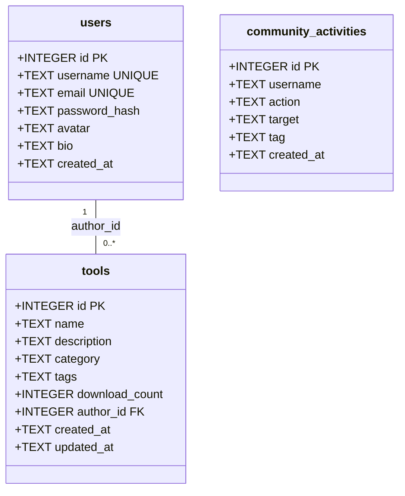
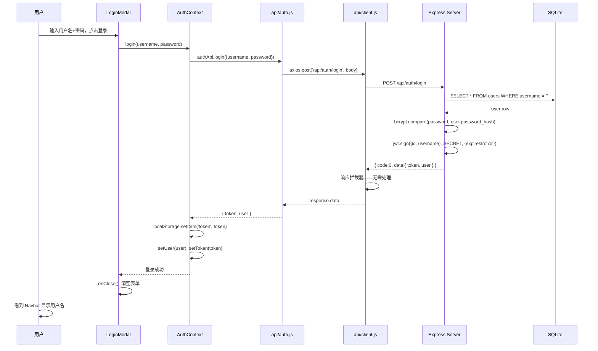
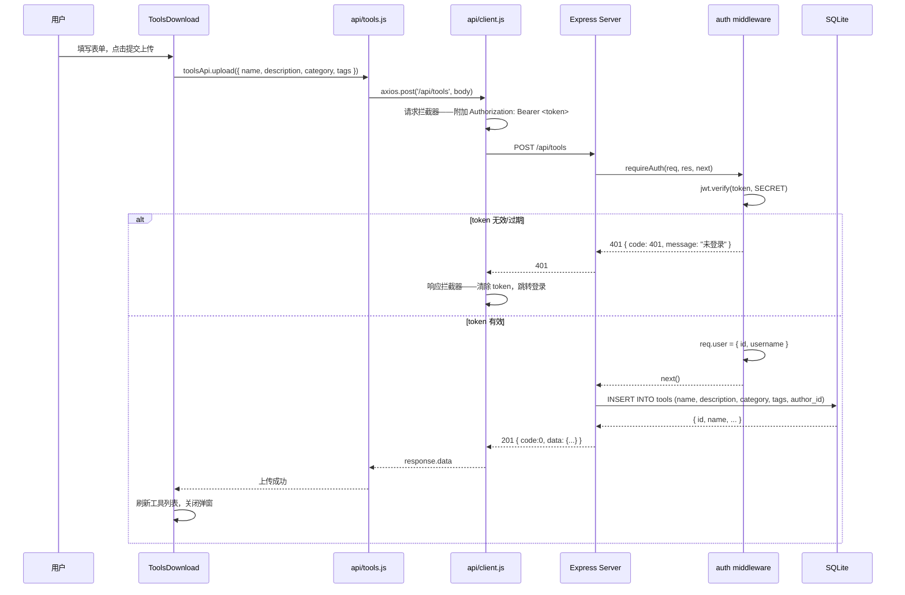
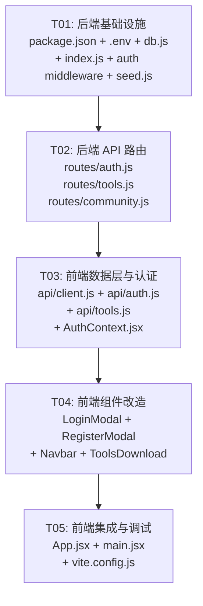

# 码坚强后端架构设计文档

> 作者: Bob (Architect)  
> 日期: 2025-07-01  
> 版本: v1.0

---

## Part A: 系统设计

---

### 1. 实现方案

#### 1.1 核心技术挑战

| 挑战 | 分析 | 方案 |
|------|------|------|
| 前后端分离联调 | Vite dev server 端口 3000，Express 端口 3001，跨域问题 | Vite proxy 代理 `/api` 到 `localhost:3001` |
| JWT 状态管理 | 登录后前端需全局共享用户状态、自动附带 token | React Context + axios 拦截器 |
| SQLite 并发 | better-sqlite3 是同步 API，Express 默认异步 | better-sqlite3 的同步特性在单进程下无并发问题，无需额外处理 |
| 密码安全 | 明文存储不可接受 | bcryptjs 哈希 + salt |
| 种子数据 | 首次启动需预置工具和动态数据 | `db/seed.js` 幂等脚本，启动时自动执行 |

#### 1.2 框架与库选型

| 层级 | 技术 | 版本 | 理由 |
|------|------|------|------|
| 运行时 | Node.js | ≥18 | LTS，ES Module 支持 |
| Web 框架 | Express.js | ^4.19 | 社区成熟，中间件生态完善 |
| 数据库驱动 | better-sqlite3 | ^11.0 | 同步 API，零配置，性能优异 |
| 密码哈希 | bcryptjs | ^2.4 | 纯 JS 实现，跨平台无编译问题 |
| JWT | jsonwebtoken | ^9.0 | 行业标准，简单易用 |
| 请求日志 | morgan | ^1.10 | Express 标准日志中间件 |
| 环境变量 | dotenv | ^16.4 | 加载 `.env` 配置 |
| 跨域 | cors | ^2.8 | 允许前端跨域请求（生产备用） |
| 前端 HTTP | axios | ^1.7 | 拦截器支持好，比 fetch 更简洁 |

#### 1.3 架构模式

```
┌─────────────────────────────────────────────────┐
│  前端 (Vite + React, :3000)                       │
│  ┌──────────┐ ┌──────────┐ ┌──────────────────┐  │
│  │AuthContext│ │api/client│ │pages/components  │  │
│  └────┬─────┘ └────┬─────┘ └────────┬─────────┘  │
│       │             │               │            │
│       └─────────────┴───────────────┘            │
│                     │ axios (Vite proxy)          │
└─────────────────────┼────────────────────────────┘
                      │ /api/*
┌─────────────────────┼────────────────────────────┐
│  后端 (Express, :3001)                            │
│                     ▼                             │
│  ┌──────────┐ ┌──────────┐ ┌──────────────────┐  │
│  │ middleware│ │  routes  │ │   db.js (SQLite) │  │
│  │  auth    │ │  auth    │ │   better-sqlite3 │  │
│  │  cors    │ │  tools   │ │                  │  │
│  │  morgan  │ │community │ │                  │  │
│  └──────────┘ └──────────┘ └──────────────────┘  │
└──────────────────────────────────────────────────┘
```

---

### 2. 文件列表

#### 2.1 新增文件（后端）

```
server/
├── index.js                  # Express 入口，中间件注册，路由挂载，启动服务
├── db.js                     # better-sqlite3 初始化，建表语句，导出 db 实例
├── middleware/
│   └── auth.js               # JWT 验证中间件 (requireAuth)
├── routes/
│   ├── auth.js               # POST /register, /login, GET /me
│   ├── tools.js              # GET /, POST /, POST /:id/download
│   └── community.js          # GET /activities
├── seed.js                   # 种子数据脚本（首次运行时填充 tools + community_activities）
├── .env                      # JWT_SECRET, PORT 等环境变量
└── package.json              # 后端依赖声明
```

#### 2.2 新增文件（前端）

```
src/
├── contexts/
│   └── AuthContext.jsx        # 全局认证状态：user, token, login(), logout(), register()
├── api/
│   ├── client.js             # axios 实例，baseURL=/api，请求/响应拦截器
│   ├── auth.js               # login(), register(), getMe() API 封装
│   └── tools.js              # getTools(), uploadTool(), downloadTool() API 封装
```

#### 2.3 修改文件（前端）

```
src/
├── main.jsx                  # 添加 AuthProvider 包裹
├── App.jsx                   # 接入 useAuth()，管理弹窗开关
├── components/
│   ├── Navbar.jsx            # 登录态显示用户名+登出，未登录显示登录/注册按钮
│   ├── LoginModal.jsx        # 接入真实登录 API
│   └── RegisterModal.jsx     # 接入真实注册 API
└── pages/
    └── ToolsDownload.jsx     # 从 API 加载工具列表，真实上传
vite.config.js                # 添加 proxy 配置
```

---

### 3. 数据结构与接口

#### 3.1 数据库 ER 图



#### 3.2 API 接口定义

```
所有 API 响应格式：{ code: 0 | 非0, data: ... | null, message: string }

POST /api/auth/register
  Request:  { username: string, email: string, password: string }
  Response: { code: 0, data: { id, username, email, created_at }, message: "注册成功" }
  Errors:   400 参数校验失败, 409 用户名/邮箱已存在

POST /api/auth/login
  Request:  { username: string, password: string }
  Response: { code: 0, data: { token: string, user: { id, username, email } }, message: "登录成功" }
  Errors:   400 参数校验失败, 401 用户名或密码错误

GET /api/auth/me
  Headers:  Authorization: Bearer <token>
  Response: { code: 0, data: { id, username, email, avatar, bio, created_at }, message: "ok" }
  Errors:   401 未登录或 token 无效/过期

GET /api/tools
  Query:    ?search=&category=&page=1&limit=20
  Response: { code: 0, data: { list: Tool[], total: number }, message: "ok" }

POST /api/tools
  Headers:  Authorization: Bearer <token>
  Request:  { name: string, description: string, category?: string, tags?: string[] }
  Response: { code: 0, data: { id, name, ... }, message: "上传成功" }
  Errors:   400 参数校验, 401 未登录

POST /api/tools/:id/download
  Response: { code: 0, data: { download_count: number }, message: "ok" }
  Errors:   404 工具不存在

GET /api/community/activities
  Query:    ?limit=50
  Response: { code: 0, data: Activity[], message: "ok" }
```

---

### 4. 程序调用流程

#### 4.1 用户登录流程



#### 4.2 工具上传流程



---

### 5. 待明确事项

| # | 事项 | 假设 |
|---|------|------|
| 1 | 生产环境部署时前端静态文件如何服务？ | 假设开发阶段：Vite dev server + Express 分开运行。生产部署由团队后续决定（Nginx 反向代理或 Express 托管 dist） |
| 2 | 密码强度规则 | 假设最小 6 位字符，不做复杂度限制 |
| 3 | 工具列表分页默认值 | 假设 page=1, limit=20 |
| 4 | 下载计数是否需要防刷 | 假设不做频率限制，每次 POST 即 +1 |
| 5 | community_activities 的 seed 数据条目数 | 假设 20 条，与实际前端展示匹配 |

---

## Part B: 任务分解

---

### 6. 依赖包列表

**后端 (server/package.json)**:

```
- express@^4.19.2          # Web 框架
- better-sqlite3@^11.3.0   # SQLite 数据库驱动
- bcryptjs@^2.4.3          # 密码哈希
- jsonwebtoken@^9.0.2      # JWT 签发与验证
- cors@^2.8.5               # 跨域中间件
- morgan@^1.10.0            # HTTP 请求日志
- dotenv@^16.4.5            # 环境变量
```

**前端新增 (根 package.json dependencies)**:

```
- axios@^1.7.2             # HTTP 客户端
```

---

### 7. 任务列表

| Task ID | 任务名称 | 源文件 | 依赖 | 优先级 |
|---------|----------|--------|------|--------|
| **T01** | 后端基础设施 | `server/package.json`, `server/.env`, `server/db.js`, `server/index.js`, `server/middleware/auth.js`, `server/seed.js` | 无 | P0 |
| **T02** | 后端 API 路由 | `server/routes/auth.js`, `server/routes/tools.js`, `server/routes/community.js` | T01 | P0 |
| **T03** | 前端数据层与认证 | `src/api/client.js`, `src/api/auth.js`, `src/api/tools.js`, `src/contexts/AuthContext.jsx` | T02 | P0 |
| **T04** | 前端组件改造 | `src/components/LoginModal.jsx`, `src/components/RegisterModal.jsx`, `src/components/Navbar.jsx`, `src/pages/ToolsDownload.jsx` | T03 | P1 |
| **T05** | 前端集成与调试 | `src/App.jsx`, `src/main.jsx`, `vite.config.js` | T04 | P1 |

---

### 8. 共享知识

```
## API 约定
- 基础 URL: /api（Vite proxy 转发到 localhost:3001）
- 响应格式: { code: number, data: any | null, message: string }
  - code === 0  表示成功
  - code !== 0  表示业务错误
- 分页参数: ?page=1&limit=20
- 所有 POST/PUT 请求 Content-Type: application/json

## JWT 约定
- 存储: localStorage key = 'token'
- 过期: 7 天 (7d)
- 请求: Authorization: Bearer <token>
- 无效/过期处理: 清除 token，提示重新登录

## 密码约定
- 最小长度: 6 位
- 存储: bcryptjs hash, saltRounds = 10
- 跳过邮箱验证

## 数据库约定
- SQLite 文件路径: server/data.db
- 时间格式: ISO 8601 UTC 字符串 (CURRENT_TIMESTAMP)
- tags 字段存储为 JSON 字符串数组: '["tag1","tag2"]'
- 首次启动自动建表 + 运行 seed

## 端口约定
- 前端 Vite dev: 3000
- 后端 Express: 3001

## 错误码约定
- 0:     成功
- 400:   参数校验失败
- 401:   未登录或 token 无效
- 404:   资源不存在
- 409:   冲突（用户名/邮箱已存在）
- 500:   服务器内部错误
```

---

### 9. 任务依赖图



---

## 附录: 各任务详细说明

### T01: 后端基础设施

**创建文件**:
- `server/package.json` — 声明后端 7 个依赖，`"type": "module"`, scripts: `"dev": "node --watch index.js"`, `"seed": "node seed.js"`
- `server/.env` — `PORT=3001`, `JWT_SECRET=code_strong_secret_key_2025`
- `server/db.js` — 初始化 better-sqlite3，执行 CREATE TABLE IF NOT EXISTS（3 张表），导出 db 实例
- `server/index.js` — Express 应用：cors + morgan + express.json + 挂载路由 + 错误处理 + 监听 3001，启动时自动执行 seed
- `server/middleware/auth.js` — 从 Authorization header 提取 Bearer token，jwt.verify，挂载 req.user，失败返回 401
- `server/seed.js` — INSERT OR IGNORE 种子数据：8 条 tools + 20 条 community_activities

### T02: 后端 API 路由

**创建文件**:
- `server/routes/auth.js` — POST /register（校验→bcrypt→INSERT→返回用户信息），POST /login（查用户→bcrypt.compare→jwt.sign→返回token+user），GET /me（requireAuth→返回req.user完整信息）
- `server/routes/tools.js` — GET /（分页+搜索+按download_count降序），POST /（requireAuth→校验→INSERT→返回工具），POST /:id/download（UPDATE download_count+1→返回新计数）
- `server/routes/community.js` — GET /activities（按created_at降序，limit默认50）

### T03: 前端数据层与认证

**创建文件**:
- `src/api/client.js` — axios.create({ baseURL: '/api' })，请求拦截器（从localStorage读token附加Authorization），响应拦截器（401时清除token+user，触发登出）
- `src/api/auth.js` — { login, register, getMe } 三个函数
- `src/api/tools.js` — { getTools, uploadTool, downloadTool } 三个函数
- `src/contexts/AuthContext.jsx` — createContext + AuthProvider 组件，维护 user/token/loading 状态，暴露 login/logout/register 方法，初始化时从 localStorage 恢复 token 并调用 getMe 验证

### T04: 前端组件改造

**修改文件**:
- `LoginModal.jsx` — handleLogin 改为调用 AuthContext.login()，处理 loading 状态和错误提示，去掉模拟代码
- `RegisterModal.jsx` — handleRegister 改为调用 AuthContext.register()，去掉模拟代码
- `Navbar.jsx` — 使用 useAuth() 获取 user 和 logout，登录态显示用户名+登出按钮，未登录显示登录/注册按钮，移除 onLoginClick/onRegisterClick props 依赖
- `ToolsDownload.jsx` — useEffect 从 API 加载 tools 列表替代 import，uploadSubmit 调用 toolsApi.upload，下载按钮调用 toolsApi.download 更新计数，添加 loading 和 empty 状态处理

### T05: 前端集成与调试

**修改文件**:
- `vite.config.js` — 添加 server.proxy: `{ '/api': { target: 'http://localhost:3001', changeOrigin: true } }`
- `src/main.jsx` — 用 `<AuthProvider>` 包裹 `<App />`
- `src/App.jsx` — 用 useAuth() 接管登录/注册弹窗开关，移除 props 传递到 Navbar，登录成功后自动关闭弹窗
